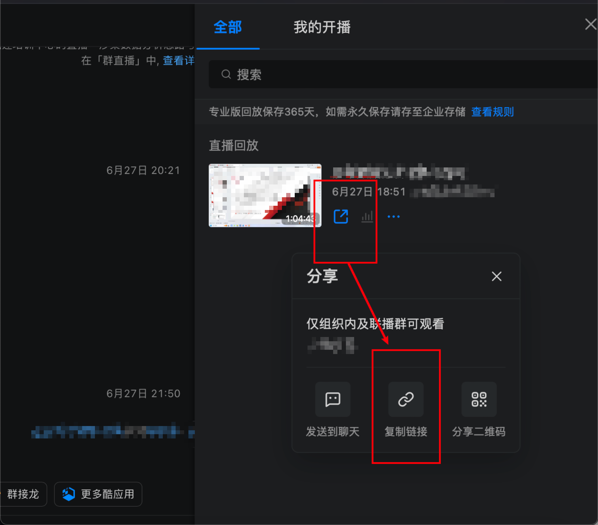

# DingTalkLiveDownload
DingTalkLiveDownload——钉钉直播回放下载器

这个工具旨在帮助用户方便地下载钉钉上的回放视频，便于离线观看和保存重要会议或课程内容。

## 特性

- 快速下载钉钉回放视频
- 用户友好的命令行界面
- 支持批量下载

## 前提条件

在使用本工具前，请确保你的系统中已安装以下软件：

- Go
- ffmpeg
- Google Chrome

## 安装

首先，克隆本项目到本地：

```bash
git clone https://github.com/b3nguang/DingTalkLiveDownload.git
cd DingTalkLiveDownload
./build.sh
```

## 使用方式



获取钉钉分享回放链接-复制链接-打开命令行窗口-执行以下命令

```bash
# MacOS运行
./DingTalkLiveDownload_darwin_arm64 -u "https://n.dingtalk.com/dingding/live-room/index.html?roomId=xxx&liveUuid=xxx"

# Windows运行
./DingTalkLiveDownload_windows_amd64.exe -u "https://n.dingtalk.com/dingding/live-room/index.html?roomId=xxx&liveUuid=xxx"
```

## 免责声明

本工具仅供学习和研究目的，请勿用于非法用途。用户因使用本工具产生的一切后果，本项目开发者不承担任何责任。

## 参考

https://github.com/NAXG/GoDingtalk/

本工具代码是参考GoDingtalk重构的，参考了fscan的项目结构。
